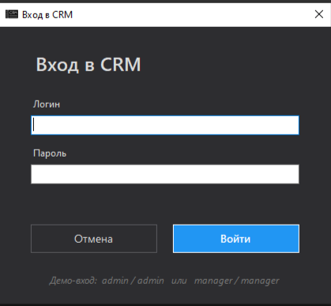
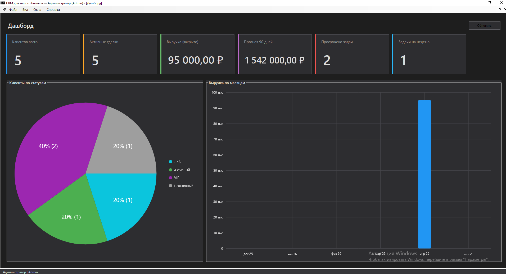
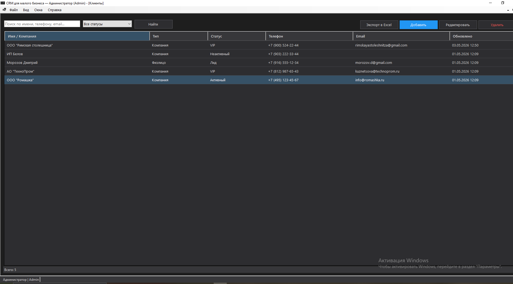
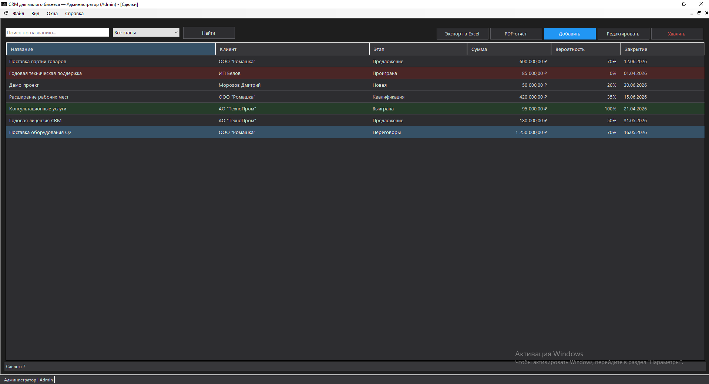
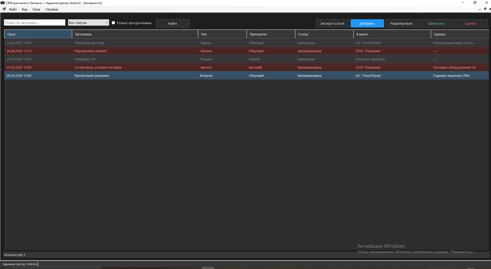
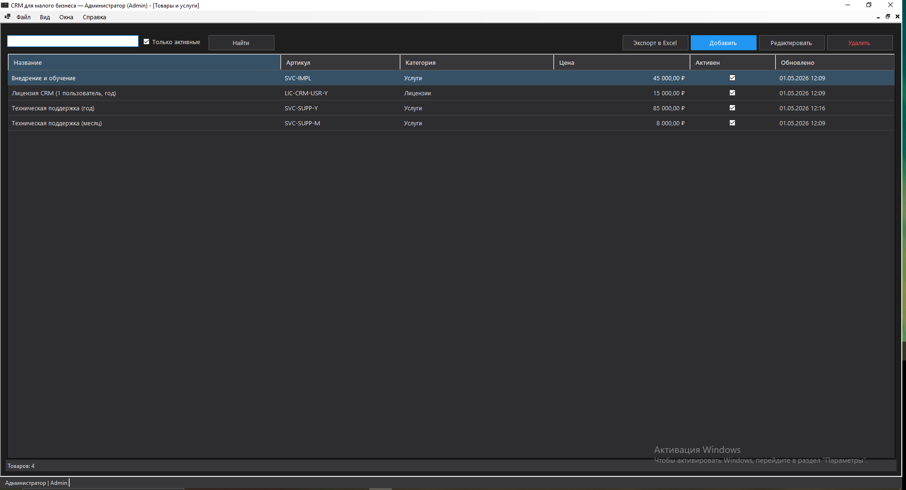

# CrmWinForms

CRM для малого бизнеса. WinForms MDI-приложение на **.NET 10**, написано в духе Clean Architecture с разделением на слои Core / Infrastructure / WinForms.

Локализация на русском, светлая и тёмная темы, экспорт в Excel и PDF, глобальный поиск, графики на дашборде и сортировка таблиц.

---

## Содержание

- [Скриншоты](#скриншоты)
- [Возможности](#возможности)
- [Архитектура](#архитектура)
- [Технологии](#технологии)
- [Запуск из исходников](#запуск-из-исходников)
- [Сборка standalone-exe](#сборка-standalone-exe)
- [Структура репозитория](#структура-репозитория)

---

## Скриншоты

### Вход в систему



### Дашборд

Карточки ключевых метрик, круговая диаграмма «клиенты по статусам» с процентами, столбчатый график выручки по месяцам.



### Клиенты

Поиск, фильтр по статусам, экспорт в Excel, 3-state сортировка по любой колонке.



### Сделки

Воронка из 6 этапов с подсветкой выигранных и проигранных, экспорт в Excel и PDF-отчёт по выбранной сделке.



### Активности

Звонки, встречи, письма и задачи. Просроченные подсвечены красным, завершённые серым.



### Товары

Каталог товаров и услуг с артикулами, ценами и категориями.



---

## Возможности

### Сущности

- **Клиенты** - физлица и компании. Реквизиты (ИНН, контактное лицо, адрес, заметки), статусы (Лид / Активный / VIP / Неактивный / Заблокирован), фильтр и поиск по имени, телефону, email, ИНН.
- **Сделки** - воронка из 6 этапов: Новая -> Квалификация -> Предложение -> Переговоры -> Выиграна / Проиграна. Сумма, вероятность, ожидаемая и фактическая дата закрытия. Доменный сервис `DealPipelineService` валидирует допустимые переходы между этапами.
- **Активности** - звонки, встречи, письма и задачи. Привязка к клиенту и/или сделке, приоритеты (Низкий / Обычный / Высокий), отметка «Завершить», подсветка просроченных.
- **Товары и услуги** - справочник для каталога малого бизнеса (название, артикул, категория, цена, флаг активности).
- **Пользователи** - учётные записи с ролями (Admin / Manager / Viewer). Управление пользователями доступно только Admin'у. Пароли хранятся как PBKDF2-хеши (100 000 итераций SHA-256).

### Интерфейс

- **Дашборд** - 6 карточек ключевых метрик (всего клиентов, активные сделки, закрытая выручка, прогноз на 90 дней, просроченные задачи, задачи на неделю), круговая диаграмма «клиенты по статусам» с процентами и абсолютным количеством, столбчатый график выручки по месяцам.
- **Глобальный поиск** (Ctrl+K) - одно окно с агрегацией по 4 сущностям (клиенты, сделки, активности, товары), debounce 300 мс между нажатиями клавиш.
- **Темы** - светлая и тёмная, переключаются через меню «Вид -> Тема». Применение требует перезапуска (выбор сохраняется в `%APPDATA%\CrmApp\theme.json`).
- **3-state сортировка** - клик по заголовку столбца: А -> Я, потом Я -> А, потом исходный порядок. Работает для текстов, чисел и дат - тип определяется по ключу сортировки.
- **Авто-обновление** - дашборд и списки сами перечитывают данные при возврате с диалога редактирования или переключении между MDI-окнами.

### Отчёты и экспорт

- **Excel-экспорт** - кнопка на каждом списке. Сохраняет числа, даты и денежные суммы нативными Excel-типами (для корректной сортировки и фильтрации в самом Excel), с автофильтром и автошириной колонок.
- **PDF-отчёт по сделке** - одна страница A4 с параметрами сделки, реквизитами клиента, описанием и таблицей связанных активностей.

### Инженерные мелочи

- **Атомарная запись JSON** - через временный файл и rename, с опциональным `.bak` перед перезаписью.
- **Маска ввода телефона** в форме клиента (`+7 (000) 000-00-00`) и ограничение длины ИНН.
- **Валидация форм** через FluentValidation с локализованными сообщениями.
- **DI-контейнер** проверяет граф зависимостей при запуске (`ValidateOnBuild = true`).

---

## Архитектура

| Слой | Роль | Зависит от |
| --- | --- | --- |
| `CrmApp.Core` | Доменные модели, enum'ы, value-object Money, абстракции репозиториев и сервисов, FluentValidation-валидаторы | FluentValidation |
| `CrmApp.Infrastructure` | JSON-репозитории, доменные сервисы (Auth, DealPipeline, Dashboard), сидер демо-данных, ClosedXML-экспорт, QuestPDF-отчёты | Core, Microsoft.Extensions.* |
| `CrmApp.WinForms` | Формы (MDI), Composition (DI), темизация, локализация enum'ов, глобальный поиск | Core, Infrastructure, LiveChartsCore |

Данные приложения хранятся в `%APPDATA%\CrmApp\` (см. `appsettings.json` -> `JsonStorage:DataFolder`). Тема пользователя - в том же каталоге в `theme.json`.

---

## Технологии

| Категория | Стек |
| --- | --- |
| Платформа | C# 12, .NET 10, Windows Forms (MDI) |
| Инфраструктура | `Microsoft.Extensions.*` 10.x (DI, Configuration, Logging, Hosting) |
| Валидация | FluentValidation 11.x (Apache 2.0) |
| Графики | LiveChartsCore.SkiaSharpView.WinForms 2.x |
| Excel | ClosedXML |
| PDF | QuestPDF (Community-лицензия) |
| Тесты | xUnit + coverlet |
| Управление пакетами | Central Package Management (`Directory.Packages.props`) |

---

## Запуск из исходников

```bash
dotnet restore
dotnet build
dotnet run --project src/CrmApp.WinForms
```

Демо-логины (создаются при первом запуске сидером, если файл `users.json` ещё пуст):

| Логин | Пароль | Роль |
| --- | --- | --- |
| `admin` | `admin` | Администратор |
| `manager` | `manager` | Менеджер |

---

## Сборка standalone-exe

Для запуска без установленного .NET Runtime:

```bash
publish.cmd
```

Или из PowerShell:

```powershell
powershell -ExecutionPolicy Bypass -File .\publish.ps1
```

Скрипт делает три шага:

1. `dotnet publish` в Release с `PublishSingleFile=true` и `--self-contained` - получится один `CrmApp.exe` ~72 MB.
2. Копирует exe в `%LOCALAPPDATA%\CrmApp\CrmApp.exe`.
3. Создаёт ярлык `CRM.lnk` на рабочем столе.

После запуска exe не требует .NET - всё уже внутри.

---

## Структура репозитория

```
CrmWinForms/
├── src/
│   ├── CrmApp.Core/            # Модели, enum'ы, абстракции, валидаторы
│   ├── CrmApp.Infrastructure/  # JSON-репозитории, сервисы, экспорт
│   └── CrmApp.WinForms/        # Формы, DI, темизация, поиск
├── docs/
│   └── screenshots/            # Скриншоты для README
├── publish.cmd / publish.ps1   # Сборка standalone-exe + ярлык
├── make-icon.ps1               # Генерация icon.ico из Icon.jpg
├── Directory.Build.props       # Общие настройки проектов
├── Directory.Packages.props    # Централизованные версии NuGet
├── global.json                 # Фиксация SDK 10.0.x
├── nuget.config                # Только nuget.org как источник
└── CrmApp.sln                  # Visual Studio Solution
```

---

## Лицензия

Учебный проект. Используйте на свой страх и риск.
